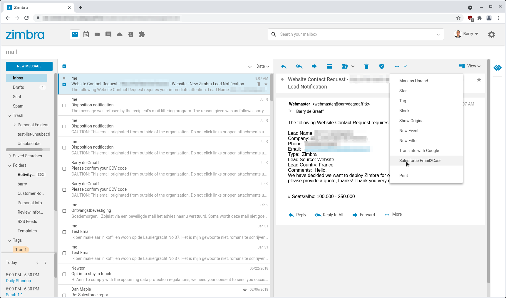
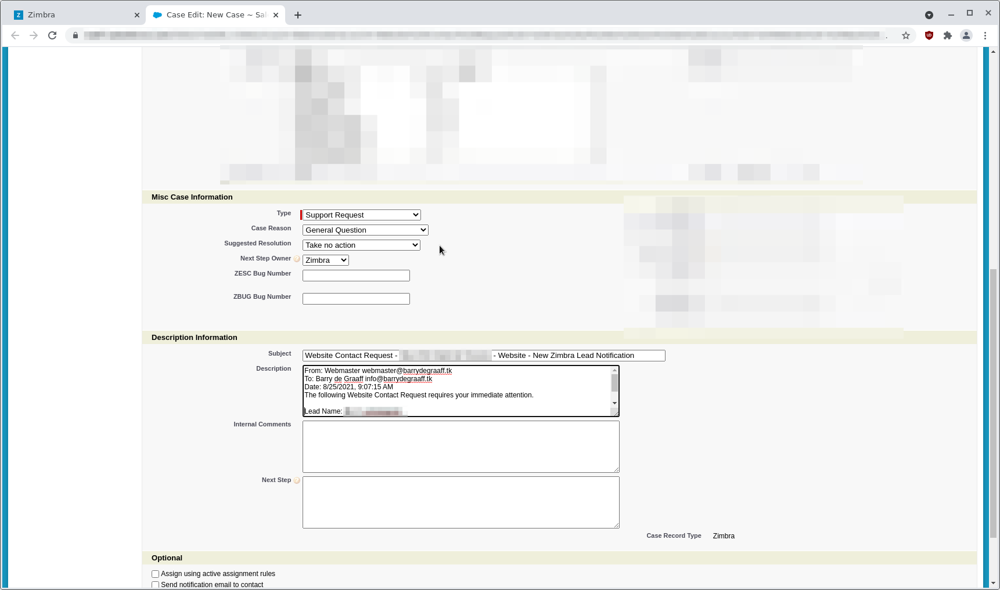

# Salesforce Zimlet Email2Case

This Zimlet adds a Email2Case menu item in the More menu.

## Configure and deploy the Zimlet:
      
Get zimbra-zimlet-salesforce.zip and as Zimbra user:

      zmzimletctl deploy zimbra-zimlet-salesforce.zip
      
To configure the sfsubdomain in the Zimlet add your url and create a config template:

      echo '<zimletConfig name="zimbra-zimlet-salesforce" version="0.0.1">
          <global>
              <property name="sfsubdomain">na87</property>
          </global>
      </zimletConfig>' > /tmp/salesforce_config_template.xml
           
Import the new configuration file by the running following command:

      zmzimletctl configure /tmp/salesforce_config_template.xml
	  

You can find your Salesforce sub domain by logging into Salesforce from the web browser and check the address bar.

## Screenshots

> 
> 
